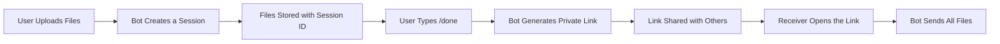

<div align="center">


<div style="margin: 20px 0;">
  
</div>

**Telegram bot for uploading files and generating private access links**

</div>

---

## ✨ Features

🎯 **Core Features:**
- 📤 Upload multiple files (documents, photos, videos, audio, stickers)
- 🔗 Generate private access links for uploaded files
- 💾 Session-based storage system
- 🔒 Secure file sharing with unique session IDs
- ⚡ Fast and efficient file retrieval
- 📊 JSON-based local database
- 🔄 Long polling for real-time updates

---

## 🎯 How It Works

> 📌 **Flow Overview**



1. **Upload**: Send files to the bot
2. **Session**: Bot creates a unique session for your uploads
3. **Generate Link**: Type `/done` to get a private access link
4. **Share**: Share the link with anyone
5. **Access**: Anyone with the link can retrieve the files

---

## 📦 Installation

### Prerequisites

Before starting, make sure you have:
- ✅ [Node.js](https://nodejs.org/) (v14 or higher)
- ✅ npm (comes with Node.js)
- ✅ A Telegram account

### Step 1: Clone the Repository

```bash
git clone https://github.com/sychoxhassan/LwuStorageBot.git
cd LwuStorageBot
```

### Step 2: Install Dependencies

```bash
npm install
```

This will install the required package:
- `node-fetch` - For making HTTP requests to Telegram API

---

## ⚙️ Configuration

### 🔑 Step 1: Create Your Telegram Bot

1. **Open Telegram** and search for [@BotFather](https://t.me/BotFather)
2. **Start a chat** with BotFather by clicking `/start`
3. **Create a new bot** by sending `/newbot`
4. **Enter bot name** (e.g., "My Storage Bot")
5. **Enter bot username** (must end with `bot`, e.g., "MyStorageBot")
6. **Copy the Bot Token** - BotFather will give you a token like:
   ```
   1234567890:ABCdefGHIjklMNOpqrsTUVwxyz
   ```

⚠️ **IMPORTANT**: Never share your bot token publicly!

### 📝 Step 2: Configure the Bot

Open `index.js` file and update the following:

#### 🔐 Bot Token Configuration

**Line 31-32** in `index.js`:

```javascript
// 🔹 Paste your Bot Token here
// ⚠️ NEVER share this token publicly
const BOT_TOKEN = "TokenHere";  // ← Replace "TokenHere" with your actual token
```

**Example:**
```javascript
const BOT_TOKEN = "1234567890:ABCdefGHIjklMNOpqrsTUVwxyz";
```

#### 🤖 Bot Username Configuration

**Line 42-43** in `index.js`:

```javascript
// 🔹 Enter your bot username WITHOUT '@'
const BOT_USERNAME = "Without @";  // ← Replace with your bot username
```

**Example:**
```javascript
// If your bot is @MyStorageBot
const BOT_USERNAME = "MyStorageBot";  // WITHOUT the @ symbol
```

### 📋 Configuration Summary

| Setting | Location | Description | Example |
|---------|----------|-------------|---------|
| `BOT_TOKEN` | Line 31 | Your bot's authentication token | `"1234567890:ABC..."` |
| `BOT_USERNAME` | Line 42 | Your bot's username (without @) | `"MyStorageBot"` |
| `DB_FILE` | Line 55 | Database file path | `"./data_store.json"` |

---

## 🚀 Deployment

### Local Deployment

#### 1️⃣ Run the Bot

```bash
npm start
```

You should see:
```
🚀 Telegram Storage Bot is running (Polling mode)
```

#### 2️⃣ Test Your Bot

1. Open Telegram
2. Search for your bot (@YourBotUsername)
3. Send `/start`
4. Upload a file
5. Type `/done`
6. Get your private link!

---

### Bot-Hosting.net Deployment

<div align="center">

[](https://bot-hosting.net/?aff=1441082647198695445)

**Free & Easy Telegram Bot Hosting**

</div>

#### 📌 Why Bot-Hosting.net?

- ✅ Free tier available
- ✅ Easy deployment
- ✅ 24/7 uptime
- ✅ No credit card required
- ✅ Perfect for Telegram bots

#### 🎯 Step-by-Step Deployment Guide

##### Step 1: Create Account

[](https://bot-hosting.net/?aff=1441082647198695445)

2. **Sign Up**
   - Click "Sign Up" button
   - Enter your email address
   - Create a strong password
   - Verify your email

3. **Login to Dashboard**
   - Use your credentials to login
   - You'll see the main dashboard

##### Step 2: Prepare Your Bot Files

Before uploading, make sure you have:
- ✅ `index.js` (with BOT_TOKEN and BOT_USERNAME configured)
- ✅ `package.json`
- ✅ All configuration complete

3. **Upload Your Files**
   - Click "Upload Files" button
   - Select all project files:
     - `index.js`
     - `package.json`
   - Or use ZIP upload (upload entire project as ZIP)

##### Step 3: Deploy & Start

1. **Click "Deploy" Button**
   
   

2. **Wait for Deployment**
   - Bot-Hosting.net will install dependencies
   - Start your bot automatically
   - You'll see logs in real-time

3. **Check Status**
   - Green status = Bot is running ✅
   - Red status = Check logs for errors ❌

##### Step 4: Monitor Your Bot

1. **View Logs**
   ```
   Dashboard → Your Bot → Logs
   ```
   You should see:
   ```
   🚀 Telegram Storage Bot is running (Polling mode)
   ```

2. **Check Statistics**
   - Uptime
   - Memory usage
   - CPU usage
   - Request count

##### Step 5: Manage Your Bot

| Action | How To |
|--------|--------|
| **Restart Bot** | Dashboard → Restart button |
| **Stop Bot** | Dashboard → Stop button |
| **Update Files** | Dashboard → Upload new files → Restart |
| **View Logs** | Dashboard → Logs tab |
| **Delete Bot** | Dashboard → Settings → Delete |

#### 🔧 Troubleshooting Bot-Hosting.net

**Bot not starting?**
1. Check logs for error messages
2. Verify BOT_TOKEN is correct
3. Ensure package.json has correct dependencies
4. Make sure Node version is compatible

**Bot stopping unexpectedly?**
1. Check memory usage (upgrade plan if needed)
2. Review error logs
3. Ensure no infinite loops in code

**Can't upload files?**
1. Check file size limits
2. Use ZIP upload for multiple files
3. Ensure files are not corrupted

---

## 💡 Usage Guide

### 🎮 Bot Commands

| Command | Description | Example |
|---------|-------------|---------|
| `/start` | Start the bot and create new session | `/start` |
| `/done` | Finish upload and generate link | `/done` |
| `/start <session_id>` | Access shared files via link | Automatic when clicking link |

### 📤 Uploading Files

1. **Start the bot**
   ```
   /start
   ```
   Bot responds: "📤 Send your files here. When finished, type /done"

2. **Send your files**
   - Send documents (PDF, DOCX, etc.)
   - Send photos (JPG, PNG, etc.)
   - Send videos (MP4, etc.)
   - Send audio files
   - Send stickers
   
   After each file: "✅ File saved! Send more or type /done"

3. **Finish and get link**
   ```
   /done
   ```
   Bot responds: "🔗 Your private access link: https://t.me/YourBot?start=xxxxx"

### 🔗 Sharing Files

1. **Copy the generated link**
   ```
   https://t.me/YourBot?start=k9x2m5n8p1q4
   ```

2. **Share with anyone**
   - Send via Telegram
   - Share via WhatsApp
   - Email the link
   - Post on social media

3. **Recipient clicks the link**
   - Opens in Telegram
   - Automatically receives all files
   - No login required!

### 🎯 Example Workflow

```
User A:
  → Sends /start
  → Uploads file1.pdf
  → Uploads photo.jpg
  → Uploads video.mp4
  → Types /done
  → Gets link: https://t.me/StorageBot?start=abc123

User A shares link with User B:
  
User B:
  → Clicks the link
  → Bot sends file1.pdf
  → Bot sends photo.jpg
  → Bot sends video.mp4
  → Done! ✅
```

---

## 📁 Project Structure

```
LwuStorageBot/
│
├── 📄 index.js              # Main bot logic
├── 📄 package.json          # Project dependencies
├── 📄 README.md            # Documentation (you are here!)
├── 📄 LICENSE              # MIT License
│
└── 📁 Generated Files
    └── 💾 data_store.json  # Database (auto-created)
```

### 📄 File Descriptions

| File | Purpose | Auto-Generated? |
|------|---------|-----------------|
| `index.js` | Main bot code with all logic | ❌ No |
| `package.json` | npm package configuration | ❌ No |
| `README.md` | Project documentation | ❌ No |
| `data_store.json` | Local database for sessions | ✅ Yes |

### 💾 Database Structure

The `data_store.json` file stores session data:

```json
[
  {
    "session": "k9x2m5n8p1q4",
    "chat": 123456789,
    "status": "closed",
    "files": [
      {
        "file_id": "BQACAgEAAxkBAAIC...",
        "file_name": "document.pdf",
        "type": "document",
        "caption": "My important file"
      },
      {
        "file_id": "AgACAgEAAxkBAAIC...",
        "file_name": "photo.jpg",
        "type": "photo",
        "caption": ""
      }
    ]
  }
]
```

**Field Explanations:**

- `session`: Unique identifier for the upload batch
- `chat`: Telegram chat ID of the user who uploaded
- `status`: "active" (uploading) or "closed" (link generated)
- `files`: Array of uploaded files
  - `file_id`: Telegram's permanent file identifier
  - `file_name`: Original filename
  - `type`: File type (document/photo/video/audio/sticker)
  - `caption`: Optional caption text

---

## 👨‍💻 Creator

<div align="center">
  
  
  <h2>🚀 Sychox2006</h2>
  
  <p style="font-style: italic; color: #666; font-size: 18px;">
    "Discipline is choosing the pain of growth today over the regret of weakness tomorrow"
  </p>
  
  ### 🌐 Connect With Me
  
  [](https://tlz.vercel.app)
  [](https://github.com/sychoxhassan)
  
  ---

<div align="center">

## ⭐ Support & Engagement

[](https://github.com/sychoxhassan/LwuStorageBot)
[](https://github.com/sychoxhassan/LwuStorageBot/fork)
[](https://github.com/sychoxhassan/LwuStorageBot/issues)

<br>

| Action | Description |
|--------|-------------|
| ⭐ **Star** | Help others discover this project |
| 🍴 **Fork** | Create your own version |
| 📢 **Share** | Grow the community |

<br>

## 📊 Project Stats


<br>

<!-- GIF link -->


</div>
